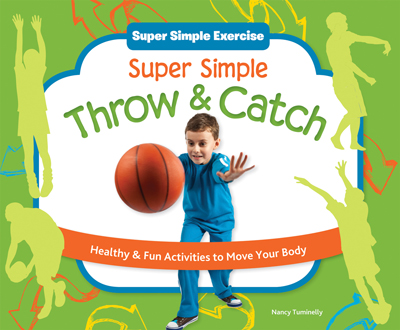
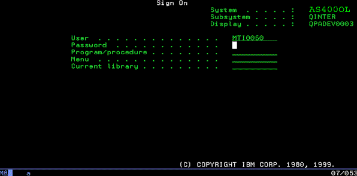

.. include:: <s5defs.txt>

About Django from A Pyramid Guy
===============================

:Authors: Chris McDonough, Agendaless Consulting
:Date: 9/6/2012 (DjangoCon 2012)

..  footer:: Chris McDonough, Agendaless Consulting

.. terrified.  django is huge part of python community i've been completely
   isolated from.  really don't know many people here.  not a django sucks
   talk, but likely to be slightly critical.  don't know whose toes i'll be
   stepping on.  i'm pretty django-ignorant so please correct me in real time
   when i'm wrong.

Who Am I
--------

- BBS nerd in the 80s.

.. 1985 on my Amiga.  Semi-old-fart.

- Bad Perl hacker until Python.  Came to Python via Zope in 1999.
  Worked at Digital Creations (aka Zope Corporation) until 2003.

.. Caught the programming bug late.  Came to Python through Zope so clearly I
   have no taste.  Now help run a consulting shop named Agendaless Consulting
   in Fredericksburg.  Python has been very good to me.

- Primary author of: Pyramid web framework, Supervisor UNIX process control
  system, Deform form system, Repoze collection of middleware, and other
  unmentionables.  Contributor to Zope, WebOb, and lots of other OSS
  projects.

Who Am I (Cont'd)
-----------------

- Quoting Glyph: "I've been doing IRC support for 10 years, so I'm pretty
  much dead inside."

.. truer words have never been spoken.

What is a Web Framework
-----------------------

- A web framework receives a request, calls user code in order to return a
  response.  Everything else is a bonus.

.. if you've written such a system, congratulations, you've written a web
   framework.  don't necessarily need to have an orm or a form system or csrf
   protection or templating, etc to be called a web framework.  the bar is
   very low.  my job during this talk is mostly to regurgitate what I know
   about Django and compare it to my expectations of what a web framework
   should do and be and how it should do those things.

Django Does a Lot Of Things Right
---------------------------------

- Django gets a lot of things right.

.. presents a surface area of exactly the right size for many people.

- If I had just come to Python, I'd probably be using it.

.. if i had been in a cryogenic freeze for the past 13 years it would be my
   intro to Python instead of Zope.

Django Docs Do It Right
-----------------------

.. primary reason I'd be using it is because of the great docs.

- Django docs raised the Python documentation bar.

.. i devoured zope's "docs" (maillist posts printed out) with great gusto.
   We're in such a better place today than we were then.

- Great resources for multiple audiences.

.. Django's not just for neckbeards like me, but for Python newbies and
   people new to web tech.  People get excited about this stuff as a result.
   Adrian and Jacob and Simon did a wonderful job.  This is so hard.  Has
   benefitted the Python community by raising people's docs expectations.

Django Defaults Do It Right
---------------------------

- Django provides people with unambiguous ways to solve 80% of their web
  development problems.

.. Reducing the number of choices that people need to make by making sane
   ones for them lets people get started quickly.  Doesn't really reinvent
   stuff: uses a relational database.  Simple model for mapping URLs to code.
   People can quickly get a mental model about how they might map their
   requirements to it.

- Doesn't prevent specialization or use of external libraries.

.. No through the web code or weird sandboxing or weird execution model.

Django Views Do It Right
------------------------

- No magical globals or threadlocals.

.. view functions have a simple model... passed a request, return a response.
   Quibbles about how templating and dispatching is handled, but for the most
   part it's workable.  

- Django view lookup and execution is very fast.

.. Benchmarks: surprised at how well Django does.

Django Forms Do It Right
------------------------

.. Normal forms can be completely custom, help with validation.  When you
   need to just generate some CRUD stuff and you're less concerned about how
   it looks and behaves, you can use modelforms.

- Decoupling of models from forms.

..

- Optional recoupling via modelforms.

Django Extensibility Does It Right
----------------------------------

- Replaceable backends for authentication and storage, etc.

.. Thriving third-party plugin environment.  Major quibbles about
   extensibility, but people make this part of Django work for them.

- Encourages an environment of plugins at different levels.

Django Reality Does It Right
----------------------------

- Can't argue with success.

.. scores of important web sites running Django.  Very popular *and* it
   works.

- Scores of very successful sites built using Django.

So WTF?
-------

- Why maintain a different framework if Django is so awesome?

.. remember those quibbles?  I have problems with Django on a number of axes
   that, if I didn't know better, I'd believe were almost entirely personal.
   They really don't make much difference to folks just getting started with
   web programming or just getting started with Python.  The more you know,
   the less satisfied you are; ignorance would be bliss.  Remember I started
   with Zope, so it proves I had almost no taste.  But you get pickier as
   time goes on; you recontextualize features in the light of new knowledge
    and things your framework did for you that you thought were so great at
   the start sometimes start to look like liabilities.  You might be able to
   get things done more quickly if it did a little less, it did those fewer
   things better.  E.g. you might not want to use a relational database, or
   you might want to use a different templating system, or you might want to
   do security differently, or you might not need the overhead of some
   middleware, or you might not want to pay the price of the ORM, or you want
   better configuration and extensibility, or whatever.  Familiarity breeds
   contempt.

What is Pyramid
---------------

- James Bennett's PyCon 2012 "Django In Depth" tutorial: ~20 minutes out of 3
  hours devoted to things that Pyramid actually does: low-level template API,
  view lookup and execution, HTTP responses, middleware.

- Pyramid is a corner of a corner of Django, magnified.  It handles view
  lookup and execution, templating, internationalization, and provides
  related convenience APIs.

- It has no built-in form generation system.  It does not prefer any
  particular persistence system.  It does not ship with an admininstrative
  application.

What Is Pyramid (Cont'd)
------------------------

- Built for extensibility and for composition of larger systems.

..

- Maybe 10K LOC, of which maybe 4K is a configuration system that allows for
  composing larger systems from smaller ones.

..

- Something like Pyramid could be used to build something like Django.

..

- Pyramid's current release (1.3) supports Python 2.6, 2.7, 3.2, and 3.3.

Small Pyramid Program
----------------------

.. sourcecode:: python

  from wsgiref.simple_server import make_server
  from pyramid.config import Configurator
  from pyramid.response import Response

  def hello_world(request):
     return Response('Hello %(name)s!' % request.matchdict)

  if __name__ == '__main__':
     config = Configurator()
     config.add_route('hello', '/hello/{name}')
     config.add_view(hello_world, route_name='hello')
     app = config.make_wsgi_app()
     server = make_server('0.0.0.0', 8080, app)
     server.serve_forever()

Is Pyramid a Microframework?
----------------------------

- Pyramid is sort-of microframework-like.  You can write a Pyramid
  application in a single file.

- Self-identifying microframeworks tend to suggest application development
  patterns to its users which promote convenience over explicitness.  

- Pyramid for better or worse doesn't do this stuff, because it aims to be
  useful in larger systems where these patterns can lead to extensibility
  problems.

.. In reality, "microframework" is a marketing term, not a technical term, so
   it kinda doesn't matter.

.. examples: a "route weighting" scheme that guesses what route ordering
   should be or route ordering defined by view function definition order.
   Global ``request`` object.  Global ``app`` object.

.. Django application is never going to be this small.  Seen people post blog
   entries about how you can use Django like this, but it's always just kinda
   unsat.  Single-file apps great for bug reproduction.  Also good for very
   tiny applications, but I very rarely personally write those.

Scaffolding (Larger Apps)
-------------------------

- Most people use a "scaffold" to generate a multifile project instead of
  starting one from scratch.

.. multifile project has a ``setup.py``, and contains a Python package.  It
   depends on other distributions.

- Generated code depends on some combination of Pyramid, Pyramid plugins, and
  other third-party libraries and frameworks.

..

- ``pcreate`` generates code that you can use to generate a Python
  *distribution* (something you can credibly upload to PyPI).

.. sourcecode:: text

   pcreate -s alchemy myproject

.. It's turtles all the way down.  Pyramid is a Python distribution,
   scaffolds can be distributed as distributions, a Pyramid application is a
   Python distribution, etc.

Higher-Level Frameworks
-----------------------

.. sourcecode:: text

                    ptah
 
                    kotti

                    poolyx

                    substanced

These are more like Django than Pyramid is like Django.  They each have an
admin interface and make choices about what type of persistence system will
be best supported.

I'm No Genius
-------------

- Pyramid does things wrong.  Many parts of Pyramid make me cringe.
  https://github.com/Pylons/pyramid/wiki/Mistakes

- But I won't let mere ineptness stop me!  Gulp.

.. much like Django core devs, we don't want to break people's working code.
   Frameworks are one-strike-and-your're-out.

Django Avoids Setuptools
------------------------

- Django lets people remain ignorant of distribution issues for maybe longer
  than they should need to be.

- Django is an outlier in Python-land convention wise: ``setup.py develop``
  of django doesn't work (although ``pip install -e .`` does), avoidance of
  setuptools also prevents use of console scripts (e.g. ``django-admin``),
  ``setup.py test`` won't work.  Django "apps" are not just Python
  distributions, they're a special Djangoey thing.

- Shared conventions are important because they spread the support burden
  across a wider base.

Django Avoids Setuptools (2)
----------------------------

- Django is itself one big "distribution" (in distutils terminology).  In
  other words, it "has no dependencies".

..

- But it indeed has parts that could be useful independent of the remainder.
  Breaking Django into smaller pieces might improve the quality of each of
  those pieces.  E.g. ``django-orm``, ``django-forms``.

..

- Big downside: documenting and supporting both in-context and out-of-context
  usage is a huge pain.  Very often just not worth it.

Django Avoids Setuptools (3)
-----------------------------

- But ignoring Python packaging issues isn't helping to improve them.  Python
  packaging and distribution needs you very badly.  We all carry the support
  load of users new to Python who come in via Django.

.. narrative documentation assumes people know Python and the web.  They
   often need remedial help in one or both, which the docs don't provide.

- Fewer documentation issues to cope with by ignoring existing tools and
  conventions, but contributing to docs for setuptools and/or recommending
  setuptools and virtualenv to new users would float all boats.

.. although we need to redocument subsystems "in context", for better or
   worse.

Subclassing Is Convenient
-------------------------

- You don't have to explain a protocol (the protocol is Python).

..

- But offering extensibility via subclassing is often a poorer choice than
  offering extensibility via composition and very explicit interfaces.
  People begin depending upon the implementation details of the classes you
  tell them to subclass.

.. Unless you're uncommonly clear about what the API of the superclass is,
   and the social contract to use nothing else but the documented API exists,
   you'll be pressured into making retroactive APIs.  Impossible to recover
   from without breaking b/w compat.

- Not uncommon to see a subclass of a subclass of a subclass of a subclass;
  figuring out how the thing works can be an exercise in pain and multiple
  editor windows.

Pyramid "Class-Based Views"
---------------------------

.. sourcecode:: python

   from pyramid.views import view_config

   class Foo(object):
       def __init__(self, request):
           self.request = request

       @view_config(route_name='fred')
       def thisnamedoesntmatter(self):
           request.response.body = 'fred'
           return request.response

Pyramid "Class-Based Views" (2)
-------------------------------

Framework effectively does when the route named ``fred`` is matched:

.. sourcecode:: python

   response = Foo(request).thisnamedoesntmatter()

No subclassing required (although it's of course possible). A "scan" picks up
the view configuration statements, or same work can be done imperatively.

.. Never actually had someone do the thing that Django CBV "as_view" is
   engineered for (fear of someone creating an instance at module scope and
   trying to use it as a view).

Pyramid "Class-Based Views" (3)
-------------------------------

.. sourcecode:: python

   from pyramid.views import view_config

   class Foo(object):
       def __init__(self, request):
           self.request = request

       @view_config(route_name='fred')
       def thisnamedoesntmatter(self):
           request.response.body = 'fred'
           return request.response

       @view_config(route_name='bob')
       def doesntmattereither(self):
           request.response.body = 'bob'
           return request.response
           

Globals are Convenient
----------------------

- You don't have to explain a protocol for obtaining a value (the protocol is
  ``import``).

- Global registries make it impossible to embed more than one application
  into the same Python process.

- Development of circular imports is likely.  Depending on
  ``DJANGO_SETTINGS_MODULE`` envvar necessitates putting settings import
  at function scope.  This is a tip-off that settings aren't-really-global.

Globals Are Convenient (Cont'd)
-------------------------------

Pyramid configuration phase:

.. sourcecode:: python

   if __name__ == '__main__':
       settings = {'mailhost':'localhost'}
       config = Configurator(settings=settings)

This is the only place where we deal with settings at a "global" level.
Instead of importing them, elsewhere in the code people do e.g.:

.. sourcecode:: python

   def someview(request):
       mailhost = request.registry.settings['mailhost']

Module-Scope Work Is Convenient
-----------------------------------

From Django tutorial, at module scope:

.. sourcecode:: python

  from django.contrib import admin
  admin.autodiscover()

``autodiscover()`` called for its side effects.  Presumably mutates a global
(``admin``).

Module-Scope Work Is Convenient (2)
-----------------------------------

- These things can be done at module scope without concern:

  * An import of another module or global.

  * Assignment of a variable name in the module to some constant value.

  * The addition of a function via a def statement.

  * The addition of a class via a class statement.

  * Control flow which may handles conditionals for platform-specific 
    handling or failure handling of the above.

.. Everything else is at least suspect.  Test runners and other code scanners
   can import with abandon, and side effects are often undesirable.

Module-Scope Work Is Convenient (3)
-----------------------------------

Instead of ``admin.autodiscover()`` getting called at module scope, it would
be better if a pattern like this was used:

.. sourcecode:: python

  if __name__ == '__main__':
     config = DjangoConfiguration()
     config.admin.autodiscover('app1', 'app2')

The state being mutated is not global.

.. Pyramid doesn't use or require the use of any globals.  Convenience
   decorators don't actually change the definition of a function, class, or
   method; they're just markers that can be picked up by a "scan".  A scan
   registers a mutated version of the function/class/method in an
   application-local registry.  If it's not scanned, it's not registered.

.. Can be configured entirely imperatively within the scope of an ``if
   __name__ == '__main__':`` block if so desired (no decorators required).

Pluggable Apps / Reusable Apps
------------------------------

- Pluggable apps probably aren't really that pluggable, reusable apps
  probably aren't as reusable as you might like.

..

- IMO, even a framework as high-level as Django can't really offer such a
  feature without stretching the truth just a little bit.

..

- The only thing IMO that can truly offer pluggable apps: another app.  No
  general-purpose framework can do a great job here.  (Examples: Wordpress,
  Jenkins, Plone).

Rendering Is Meta-View
----------------------

``render_to_response`` using template in view is not much fun to test.

.. sourcecode:: python

   def aview(request):
       return render_to_response('my_template.html', {'a':1})

Being able to return a dict (or another kind of object) from a view callable
is easier to unit test and allows the view code to be reused for different
renderings.

Rendering Is Meta-View (2)
-------------------------------

A Pyramid view function that has configuration which names a Mako template
renderer:

.. sourcecode:: python

   @view_config(route_name='aview', renderer='sometemplate.mak')
   def aview(request):
       return {'username':request.user.name}

Rendering Is Meta-View (3)
----------------------------

Theoretical test code:

.. sourcecode:: python

   class Dummy(object): pass

   def test_it():
      from somewhere import aview
      request = Dummy()
      request.user = Dummy()
      request.user.name = 'fred'
      assert aview(request) == {'username':'fred'}

.. The ``.mak`` extension signifies it's a template renderer.  Different
   template renderers are registered for different template extensions.
   Granted, doesnt test template rendering, but that's the job of functional
   tests, not unit tests (unit tests can run much faster).

Rendering Is Meta-View (4)
-------------------------------

The same view function can be used to render either a Mako template or as
JSON.

.. sourcecode:: python

   @view_config(route_name='aview.html', renderer='sometemplate.mak')
   @view_config(route_name='aview.json', renderer='json')
   def aview(request):
       return {'username':request.user.name}

The JSON renderer is not a template renderer (it has no extension), but it's
still a renderer.

Unit Tests
----------

- Extensive use of Django test client for tests will cause test suite to run
  more slowly than necessary.  "Integration" or "system" testing.

..

- A slow enough test suite won't be run before commit.

..

- Testers who don't understand any type of testing other than "system" or
  "integration" testing tend to bring poor testing practices to unrelated
  systems.

Static Files
------------

- Python WSGI servers are getting better at serving static files.
  E.g. Gunicorn supports ``sendfile`` on UNIX.

..

- Might be time to reconsider offloading media to a dedicated non-Python
  server and make use of what's available in WSGI-land.

End Of "But..."
---------------

- No more criticisms during this talk.

Community
---------

- Pyramid community is maybe 5%-10% the size of the Django community and it's
  growing.

..

- Your success is our success.  I'm satisfied to have Pyramid in a fight for
  the #2 Python web framework spot forever.

..

- Create adapter for WebOb that implements the Django request API?  Create an
  adapter for SQLAlchemy that implements the Django ORM API?

Collaboration (Low-Level)
-------------------------

- These are likely losers.  They are "30 year plans".  Things change so fast.
  Who will pay immediately?  Who will benefit immediately?

..

- Might be better to try to use common non-domain-specific dependencies
  (e.g. setuptools, virtualenv, WSGI middleware, etc).  It would be a great
  win to share documentation burden, even if we had to fork it for our own
  contextual requirements.

Collaboration (High-Level)
--------------------------

- Django is limited by backwards compatibility concerns.  It's impractical to
  make large architectural changes now.  Your users would kill you.

.. If you used Pyramid, you'd get URL routing, internationalization, template
   bindings, configuration extensibility, flexible view lookup and execution,
   an event system, security, documentation, Python 3 compatibility, and
   other things.

.. Pyramid community is very enthusiastic, friendly, helpful, and experienced.

- Take useful bits out of Django and turn them into independent subsystems
  that share/require no global state. Create a bw compat "django" package
  that re-gloms them all back together.

.. Benefit: bw compat for those who need it, but better software for those
   willing to use it.

- Consider Pyramid or another smaller Python framework as a base for a bw
  incompat Django offshoot.

Challenges
----------

- I challenge you to investigate how other frameworks work and steal
  liberally.

..

- I challenge you to embrace existing Python packaging and distribution
  tools.

..

- I challenge you to contribute to efforts that more directly benefit the
  broader Python web community.

Images
------

Super Simple Throw and Catch: http://www.abdopub.com/shop/pc/configurePrd.asp?idproduct=29321

Spellbook: http://alteredroute.blogspot.com/2008/10/potions-and-spells.html

Computer nerd: http://noscope.com/photostream/various/super-computer-nerd.jpg/view

Images (Cont'd)
---------------

Getting it right: http://sluggerotoole.com/2011/03/29/looking-back-at-the-dups-2007-manifesto/dup-getting-it-right-logo/

Urinals: http://www.businessblunder.com/2011/01/bad-architecture-examples/

No magic: http://gordonscruton.blogspot.com/2011/06/no-magic-please-part-1-learning.html

Images (Cont'd)
---------------

AS/400 Sign On: http://forums.speedguide.net/showthread.php?229405-AS400-question

OMG WTF: http://www.graphicshunt.com/funny/images/omg_wtf-12875.htm

Toronto skyscrapers: http://www.primalpics.com/photos/010000/2200/002174_toronto_skyscrapers.htm

