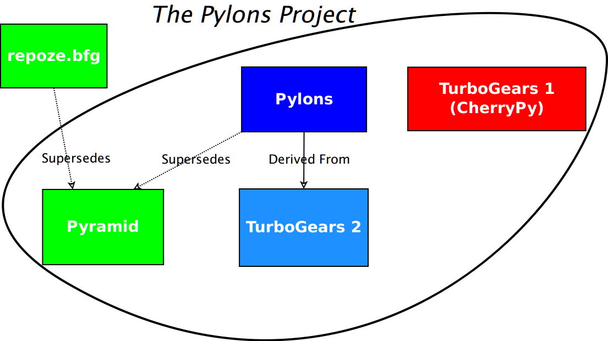
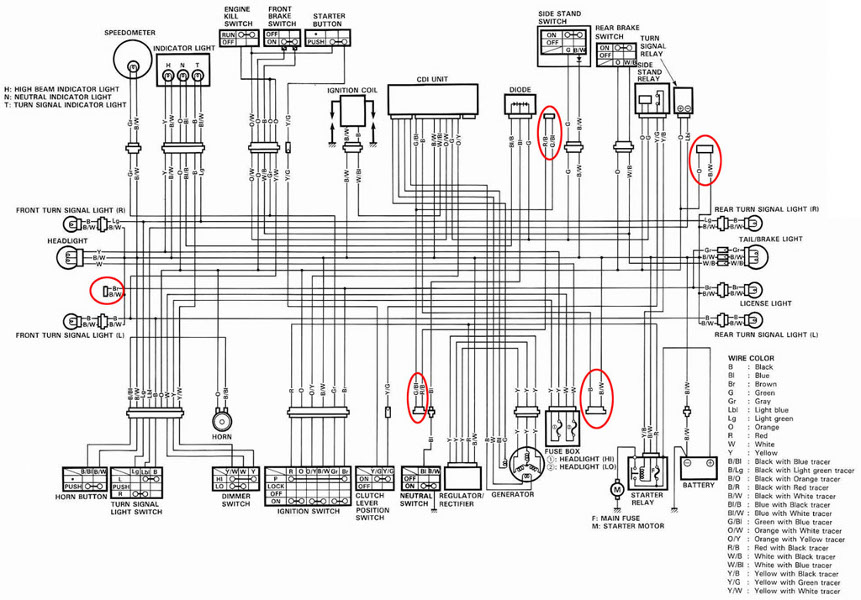

.. include:: <s5defs.txt>

About Django from A Pyramid Guy
===============================

:Authors: Chris McDonough, Agendaless Consulting
:Date: X/X/2012 (DjangoCon 2012)

..  footer:: Chris McDonough, Agendaless Consulting

.. terrified.  django is huge part of python community i've been completely
   isolated from.  really don't know many people here.  not a django sucks
   talk, but likely to be slightly critical.  don't know whose toes i'll be
   stepping on.  i'm pretty django-ignorant so please correct me in real time
   when i'm wrong.

Who Am I
--------

- BBS nerd in the 80s.

.. 1985 on my Amiga.  Semi-old-fart.

- Bad Perl hacker until Python.  Came to Python via Zope in 1999.
  Worked at Digital Creations (aka Zope Corporation) until 2003.

.. Caught the programming bug late.  Came to Python through Zope so clearly I
   have no taste.  Now help run a consulting shop named Agendaless Consulting
   in Fredericksburg.  Python has been very good to me.

- Primary author of: Pyramid web framework, Supervisor UNIX process control
  system, Deform form system, Repoze collection of middleware, and other
  unmentionables.  Contributor to Zope, WebOb, and lots of other OSS
  projects.

Who Am I (Cont'd)
-----------------

- Quoting Glyph: "I've been doing IRC support for 10 years, so I'm pretty
  much dead inside."

.. truer words have never been spoken.

.. image:: super-computer-nerd.jpg
   :align: center

What is a Web Framework
-----------------------

- A web framework receives a request, calls user code in order to return a
  response.  Everything else is a bonus.

.. my job during this talk is mostly to regurgitate what I know about Django
   and compare it to my expectations of what a web framework should do and
   be and how it should do those things.

.. image:: throwandcatch.jpg
   :align: center

Django Does a Lot Of Things Right
---------------------------------

- Django gets a lot of things right.

.. presents a surface area of exactly the right size for many people.

- If I had just come to Python, I'd probably be using it.

.. if i had been in a cryogenic freeze for the past 13 years, when I woke up
   I'd get obsessed with Django instead of getting obsessed with Zope.

.. image:: gettingitright.jpg
   :align: center

Django Docs Do It Right
-----------------------

.. primary reason I'd be using it is because of the great docs.

- Django docs broke the Python documentation curve.

.. i devoured zope's "docs" (maillist posts printed out) with great gusto.
   We're in such a better place today than we were then.

- Great resources for multiple audiences.

.. Django's not just for neckbeards like me, but for Python newbies and
   people new to web tech.  People get excited about this stuff as a result.
   Adrian and Jacob and Simon did a wonderful job.  This is so hard.  Has
   benefitted the Python community by raising people's docs expectations.

.. image:: spellbook.jpg
   :align: center

Django Defaults Do It Right
---------------------------

- Django provides people with unambiguous ways to solve 80% of their web
  development problems.

.. Reducing the number of choices that people need to make by making sane
   ones for them lets people get started quickly.  Doesn't really reinvent
   stuff: uses a relational database.  Simple model for mapping URLs to code.
   People can quickly get a mental model about how they might map their
   requirements to it.

- Doesn't prevent specialization or use of external libraries.

.. No through the web code or weird sandboxing or weird execution model.

Django Views Do It Right
------------------------

.. view functions have a simple model... passed a request, return a response.
   Quibbles about how templating and dispatching is handled, but for the most
   part it's workable.  Benchmarks: surprised at how well Django does.

- No magical globals or threadlocals.

- Django view lookup and execution is very fast.

.. image:: nomagic.jpg
   :align: center

Django Forms Do It Right
------------------------

.. Normal forms can be completely custom, help with validation.  When you
   need to just generate some CRUD stuff and you're less concerned about how
   it looks and behaves, you can use modelforms.

- Decoupling of models from forms.

- Optional recoupling via modelforms.

.. image:: as400_sign_on.gif
   :align: center

Django Extensibility Does It Right
----------------------------------

.. Thriving third-party plugin environment.  Major quibbles about
   extensibility, but people make this part of Django work for them.

- Replaceable backends for authentication.

- Replaceable backends for storage.

- Encourages an environment of plugins at different levels.

Django Terminology Does It Right
--------------------------------

.. no idea who first came up with the idea that request/response web
   frameworks have anything to do with the MVC pattern defined via smalltalk
   in the 1980s.  Arguments about which web frameworks are "more MVC" than
   others hilarious, completely miss the point.  Django authors were smart
   enough to know how crazy that was.  

- Arguments about how a web framework implements "MVC" are usually
  distractions.

- Views and models.  No "controller".

.. Pyramid uses the same terminology as Django.  Zope happens to as well.

Django Reality Does It Right
----------------------------

.. scores of important web sites running Django.  Very popular *and* it
   works.

- Can't argue with success.

- Scores of very successful sites built using Django.

So WTF?
-------

- Why maintain a different framework if Django is so awesome?

.. remember those quibbles?  I have problems with Django on a number of axes
   that, if I didn't know better, I'd believe were almost entirely personal.
   They really don't make much difference to folks just getting started with
   web programming or just getting started with Python.  The more you know,
   the less satisfied you are; ignorance would be bliss.  Remember I started
   with Zope so it proves I had almost no taste.  But you get pickier as time
   goes on; you recontextualize features in the light of new knowledge and
   things your framework did for you that you thought were so great at the
   start sometimes start to look like liabilities.  You might be able to get
   things done more quickly if it did a little less, and what remained it did
   better.  E.g. you might not want to use a relational database, or you
   might want to use a different templating system, or you might want to do
   security differently, or you might not need the overhead of some
   middleware, or you might not want to pay the price of the ORM, or you want
   better configuration and extensibility, or whatever.  Familiarity breeds
   contempt.

.. image:: omg_wtf.jpg
   :align: center

What is Pyramid
---------------

- James Bennett's PyCon 2012 "Django In Depth" tutorial: ~20 minutes out of 3
  hours devoted to things that Pyramid actually does: low-level template API,
  view lookup and execution, HTTP responses, middleware.

- Pyramid is a corner of a corner of Django, magnified.  It handles view
  lookup and execution and provides related convenience APIs.

What Is Pyramid (Cont'd)
------------------------

- Pyramid is independent of any particular peristence system.  It has no
  built-in form generation system.  It does not prefer any particular
  templating system.  It does not ship with an admininstrative application.

- Something like Pyramid could be used to build something like Django.

How does Pyramid Relate to Pylons
---------------------------------

Might As Well Be
----------------

Pylons Project
--------------

- Project lead consolidation decision.

- Attempt to get Pylons, TurboGears and ``repoze.bfg`` communities rowing in
  the same direction.

- Pylons 1.x web framework shifted into “legacy” status.  Maintained
  indefinitely.

- New development: Pyramid and related.

- Turbogears has gone their own direction.

Is Pyramid a Microframework?
----------------------------

- Pyramid is sort of microframework-like.  You can write a Pyramid
  application in a single file.

- Self-identifying microframeworks tend to suggest application development
  patterns to its users which promote convenience over explicitness.  Pyramid
  for better or worse does not do this, because it needs to be useful in
  larger systems where these patterns can lead to extensibility problems.

- In reality, "microframework" is a marketing term, not a technical term, so
  it kinda doesn't matter.

Small Pyramid Program
----------------------

.. sourcecode:: python

  from wsgiref.simple_server import make_server
  from pyramid.config import Configurator
  from pyramid.response import Response

  def hello_world(request):
     return Response('Hello %(name)s!' % request.matchdict)

  if __name__ == '__main__':
     config = Configurator()
     config.add_route('hello', '/hello/{name}')
     config.add_view(hello_world, route_name='hello')
     app = config.make_wsgi_app()
     server = make_server('0.0.0.0', 8080, app)
     server.serve_forever()

.. Django application is never going to be this small.  Seen people post blog
   entries about how you can use Django like this, but it's always just kinda
   unsat.  This is great for bug reproduction.  It's also good for very tiny
   applications, but I very rarely write those.

Larger Pyramid Systems
----------------------

- Most people use "scaffolds" to generate multifile projects.

- Scaffolds generate code that can generate a Python *distribution*
  (something you can credibly upload to PyPI).

Pyramid and Python 3
--------------------

- Pyramid's current release (1.3) supports Python 3.2+ (as well as Python 2.6
  and 2.7).

- Most existing add-ons already ported.  When feasible, we port add-on
  dependencies (``beaker``, ``WebOb``, ``zope.*`` packages).

- We have a committment to Python 3.  It involves lots of whining and
  bitching.

I'm No Genius
-------------

- Pyramid does things wrong.  Many parts of Pyramid make me cringe.
  https://github.com/Pylons/pyramid/wiki/Mistakes

- The grass is always greener.

.. image:: urinals.jpg
   :align: center

Pyramid Docs
------------

- Culture of documentation (if it's not documented, it's broken).

- Pyramid itself has ~800 printed pages of narrative and API documentation,
  plus a few hundred pages of "cookbook" material.

- Comprehensive but pretty dry.

Docs Pain
---------

- Many pain points are related to plain old bad docs: our fault.  Docs are at
  least 10X harder to write well than the associated code and take much
  longer.  Most coders hate writing docs.  I write lots of documentation but
  it's often not very good.

- But other pain points people experience when trying to learn Pyramid from
  its docs is due to poorly documented dependencies (setuptools).  We need to
  redocument subsystems "in context", for better or worse.  (kill me now?)

Docs Pain (cont'd)
------------------

- Some pain points are due to an audience mismatch; narrative documentation
  assumes people know "Python" *and* "the web".  They often need remedial
  help in one or both, which the docs don't provide.

- "Chipin" project raised ~$5K for documentation overhaul.

Pyramid Friends
---------------

- Colander/Deform: form handling.

- SQLAlchemy: SQL database connectivity and querying.

- Pyramid-specific add-ons like ``pyramid_mailer``, ``pyramid_zodbconn``,
  ``pyramid_socketio``, ``pyramid_mongodb``, and so forth.

- The typical Pyramid application makes use of some combination of add-ons.

Scaffolding
-----------

- A scaffold renders a project.  A project is installable like any other
  setuptools distribution (it has a ``setup.py``, etc).

- The project depends on some combination of Pyramid, Pyramid plugins, and
  other third-party libraries and frameworks.

- ``zodb``, ``alchemy`` and ``starter`` scaffolds provided by Pyramid itself.
  Others are contributed to PyPI by third parties.

Bindings Packages
-----------------

A more generic package is specialized for convenient use under Pyramid via
use of a bindings package.

- ``deform`` + ``pyramid_deform``.

- ``repoze.who`` + ``pyramid_who``.

- 2X documentation burden: document once in general package docs, document
  again in bindings docs.  That's no fun.

- But this will happen anyway if your code is popular (Celery).

Higher Level Frameworks
-----------------------

- ``ptah``

- ``kotti``

- ``poolyx``

- ``substanced``

Packaging Is Like a Blast Shield
--------------------------------

- A blast shield helps keep shrapnel out.

- It can also help keep shrapnel *in*.

Packaging / Blast Shield (Cont'd)
---------------------------------

- Shrapnel tends to penetrate anything not within a blast shield.

- Every piece of software eventually blows up.

- The more blast shields you have, the more the damage is contained.

Packaging / Blast Shield (Cont'd)
---------------------------------

- But blast shields obscure the landscape.  More work required for users.

- More packages add more documentation and conceptual overhead, and more
  unwanted choice.

Django Avoids Setuptools
------------------------

- Setup.py develop of django doesn't work.

- Avoidance of setuptools also prevents use of console scripts
  (e.g. django-admin).

- Django recreates some of the patterns that setuptools provides (i.e. test
  discovery hooks).

- Developers whom are ignorant of distribution issues are very confused when
  inevitably faced with them.

Django Avoids Setuptools (2)
----------------------------

- Django's defacto avoidance of setuptools is understandable.  But it's not
  helping to improve Python packaging.  Python packaging and distribution
  needs you very badly.

- Fewer documentation issues to cope with, but contributing to docs for
  setuptools would float all boats.

Subclassing Is Convenient
-------------------------

- You don't have to explain a protocol (the protocol is Python).

- But offering extensibility via subclassing is often a poorer choice than
  offering extensibility via composition and very explicit interfaces.

Subclassing Is Convenient (Cont'd)
----------------------------------

- Why?  People begin depending upon the implementation details of the classes
  you tell them to subclass.  Unless you're extremely clear about what the
  API of the superclass is, and the social contract to use nothing else but
  the documented API exists, you'll be pressured into making retroactive
  APIs.  Impossible to recover from without breaking b/w compat.

- Not uncommon to see a subclass of a subclass of a subclass of a subclass;
  figuting out how the thing works can be an exercise in pain and multiple
  editor windows.

Globals are Convenient
----------------------

- You don't have to explain a protocol for obtaining a value (the protocol is
  ``import``).

- But the development of circular imports is inevitable.

- Global registries make it impossible to embed more than one application
  into the same Python process.

Module-Scope Work Is Convenient
-------------------------------

From Django tutorial, at module scope:

.. sourcecode:: python

  from django.contrib import admin
  admin.autodiscover()

Module-Scope Work Is Convenient (2)
-----------------------------------

- These things can be done at module scope without concern:

  * An import of another module or global.

  * Assignment of a variable name in the module to some constant value.

  * The addition of a function via a def statement.

  * The addition of a class via a class statement.

  * Control flow which may handles conditionals for platform-specific 
    handling or failure handling of the above.

Module Scope Work Is Convenient (3)
-----------------------------------

- Everything else is at least suspect.  Test runners and other code scanners
  can import with abandon, and side effects are often undesirable.

Pluggable Apps / Reusable Apps
------------------------------

- Pluggable apps probably aren't really that pluggable, reusable apps
  probably aren't as reusable as you might like.

- IMO, even a framework as high-level as Django can't really offer such a
  feature without stretching the truth just a little bit.

- The only thing that can truly offer pluggable apps: another app.  No
  general-purpose framework can do a great job here.  (Examples: Wordpress,
  Jenkins, Plone).

Rendering Is Meta-View
----------------------

- ``render_to_response`` using template in view is no fun to test.

- Returning a dict from a view callable is more fun to test.

Unit Tests
----------

- Exclusive use of Django test client for tests will cause test suite to run
  more slowly than necessary.

- A slow enough test suite won't be run before commit.

- Testers who don't understand any type of testing other than "system" or
  "integration" testing tend to bring poor testing practices to unrelated
  systems.

- Using setuptools provides nice hooks for test discovery and execution.

Static Files
------------

- Python WSGI servers are getting better at serving static files.
  E.g. Gunicorn supports ``sendfile`` on UNIX.

- Might be time to reconsider offloading media to a dedicated non-Python
  server and make use of what's available in WSGI-land.

Community
---------

- Pyramid community is maybe 5%-10% the size of the Django community.

- It's growing.

- Your success is our success.  I'd be very pleased to have Pyramid be
  considered the #2 Python web framework (at least for "Python people")
  forever.

Collaboration (Low-Level)
-------------------------

- Create adapter for WebOb or Werkzeug that implements the Django request
  API?

- Create an adapter for SQLAlchemy that implements the Django ORM API?

Collaboration (Low-Level)
-------------------------

- These are likely losers.  They are "30 year plans".  Things change so fast.
  Who will pay immediately?  Who will benefit immediately?

- Might be better to try to use common non-domain-specific dependencies
  (e.g. setuptools, virtualenv, WSGI middleware, etc).  It would be a great
  win to share documentation burden, even if we had to "fork" it for our
  own contextual requirements.

Collaboration (High-Level)
--------------------------

- Django is limited by backwards compatibility concerns.  It's impractical to
  make large architectural changes now.  Your users would kill you.

- But I could imagine somebody from the Django community creating a
  "Django-NG" or a Django-like system from whole cloth.  Or break Django
  apart into something that isn't quite bw compatible.

Collaboration (High-Level)
--------------------------

- It might make sense to consider Pyramid or another smaller framework as a
  base for such an effort.  If you used Pyramid, you'd get URL routing,
  internationalization, template bindings, configuration extensibility,
  flexible view lookup and execution, an event system, security,
  documentation, Python 3 compatibility, and other things.

- Pyramid community is very enthusiastic, friendly, helpful, and experienced.

Promoting Python
----------------

- I challenge you to not be complacent.

- I challenge you to investigate how other frameworks work.

- I challenge you to embrace existing Python packaging and distribution
  tools.

Promoting Python
-----------------

- I challenge you to finish Python 3 porting quickly.  Commit to supporting
  it in your add-ons and helping folks who have existing add-ons port.

- I challenge you to speak out when folks bash competitors.  Haters are
  everywhere, and when someone bashes Pyramid, Flask, Bottle, or Zope, and
  nobody defends against it, the hate will eventually come back to harm you.

Unknowns
--------

- Django Class-Based Views Might Not Do It Right.  ``as_view``.  Hmm.  All
  views in Pyramid are potentially generic.  They have a context passed to
  them.  Class-based views in Pyramid are not things handed down from "good
  devs" to reuse, they're just normal things.

- How does Django allow for configuration extensibility?  Conflict detection?

- Event system

- Alternate templating languages

- Exception views

- View predicates

- Transaction management

Images
------

Super Simple Throw and Catch: http://www.abdopub.com/shop/pc/configurePrd.asp?idproduct=29321

Spellbook: http://alteredroute.blogspot.com/2008/10/potions-and-spells.html

Computer nerd: http://noscope.com/photostream/various/super-computer-nerd.jpg/view

Getting it right: http://sluggerotoole.com/2011/03/29/looking-back-at-the-dups-2007-manifesto/dup-getting-it-right-logo/

Images (Cont'd)
---------------

Urinals: http://www.businessblunder.com/2011/01/bad-architecture-examples/

No controller: http://www.pwnordie.com/2009/12/30/2009-gaming-in-retrospect/project_natal_no_controller/

No magic: http://gordonscruton.blogspot.com/2011/06/no-magic-please-part-1-learning.html

Images (Cont'd)
---------------

AS/400 Sign On: http://forums.speedguide.net/showthread.php?229405-AS400-question

OMG WTF: http://www.graphicshunt.com/funny/images/omg_wtf-12875.htm

Wiring: http://www.advrider.com/forums/showthread.php?t=415263&page=9

Images (Cont'd)
---------------

Mustard aisle: http://dangerousintersection.org/2008/02/18/experiencing-the-paradox-of-choice-at-the-local-schnucks-grocery-store/
